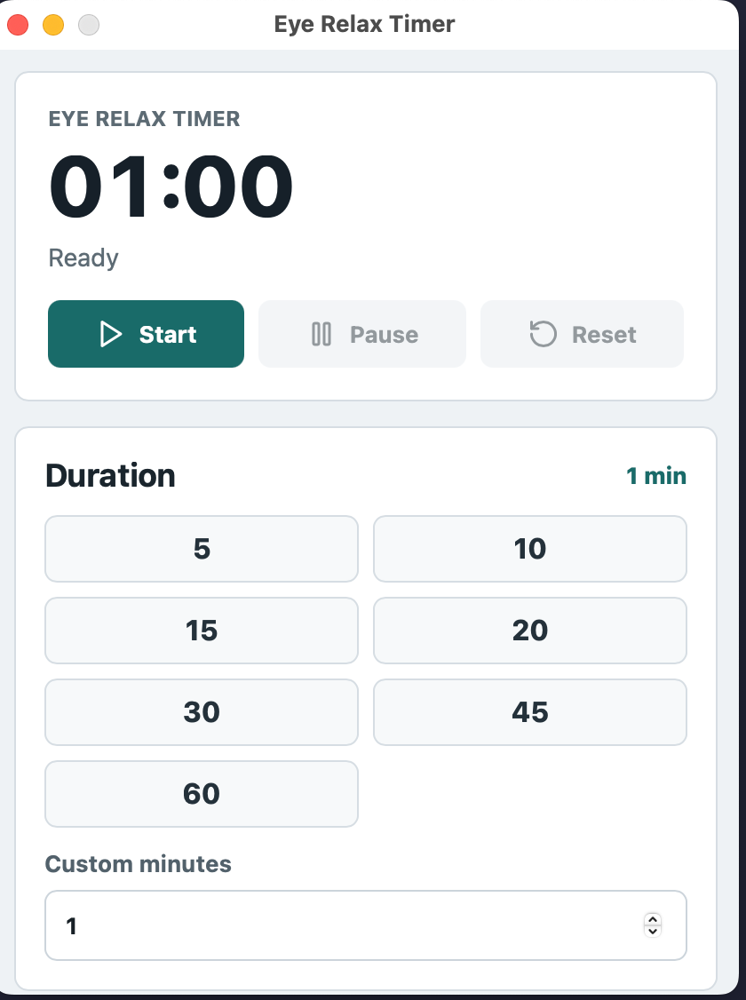
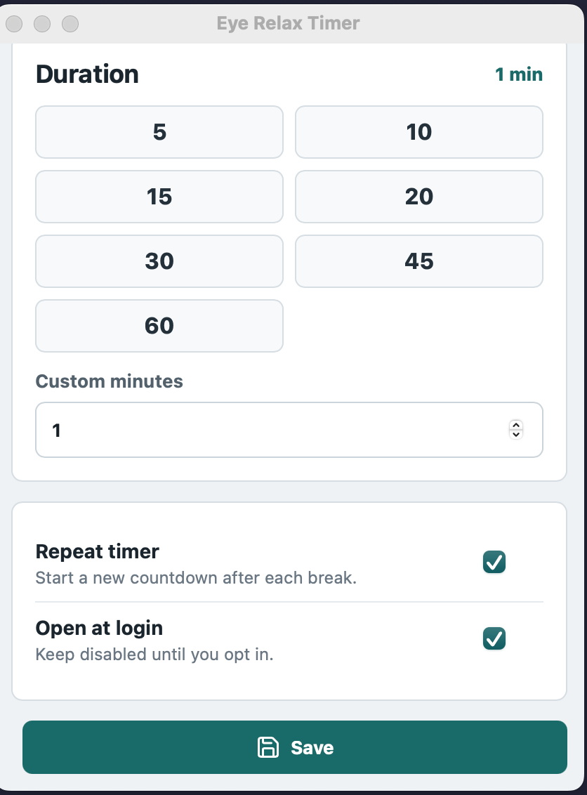
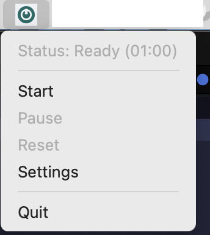

# Eye Relax Timer

Eye Relax Timer is a tray-first desktop app that helps you rest your eyes on a regular schedule. Start a countdown, get a large break reminder when time is up, then let the app repeat the cycle automatically if repeat mode is enabled.

## Screenshots







## Features

- Tray/status bar app designed to stay out of the way.
- Configurable timer presets: 5, 10, 15, 20, 30, 45, and 60 minutes.
- Custom timer duration from 1 to 240 minutes.
- Start, pause/resume, and reset controls from the settings window.
- Tray menu with status, start, pause/resume, reset, settings, and quit actions.
- Eye-rest popup that covers about 80% of the primary screen.
- 60-second break countdown.
- Optional repeat mode to automatically start the next timer after a break.
- Optional autostart at login.
- Settings persistence in the app config directory.

## Tech Stack

- Tauri v2 for the desktop shell, tray integration, windows, persistence, and native app build.
- Rust for timer state, countdown lifecycle, tray menu updates, break popup geometry, autostart, and tests.
- React 18 and TypeScript for the settings window and break popup UI.
- Vite for frontend development and production builds.
- lucide-react for UI icons.

## Getting Started

### Prerequisites

- Node.js and npm.
- Rust and Cargo.
- Tauri platform prerequisites for your operating system.

### Install Dependencies

```bash
npm install
```

### Run the Frontend Only

```bash
npm run dev
```

This starts Vite at `http://127.0.0.1:1420`.

### Run the Desktop App

```bash
npm run tauri:dev
```

This starts the Tauri app with the Vite frontend.

## Build

### Build the Frontend

```bash
npm run build
```

### Build the Tauri App

```bash
npm run tauri:build
```

The Tauri build creates platform-specific desktop bundles under `src-tauri/target`.

## Test

Run the Rust test suite:

```bash
cd src-tauri
cargo test
```

There is no frontend test script configured currently. Use `npm run build` to type-check and build the React/Vite frontend.

## Project Structure

- `src/` contains the React frontend.
- `src/App.tsx` renders either the settings window or break popup based on the window query string.
- `src-tauri/src/lib.rs` contains the app state, timer commands, tray menu, popup window lifecycle, settings persistence, autostart integration, and Rust tests.
- `src-tauri/tauri.conf.json` contains the Tauri v2 app and bundle configuration.
- `screenshots/` contains the images used in this README.
